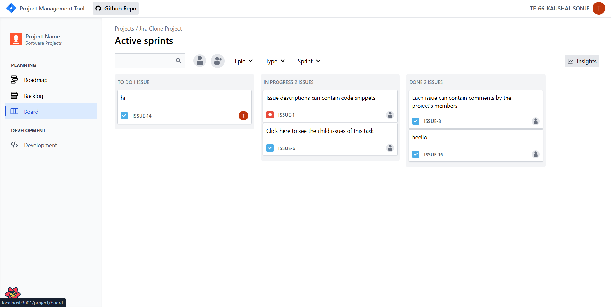

<h1 align="center">project management tool</h1>

## Features

- Written in modern React
- Uses Next js 13.4 app directory structure
- Explores basic React Server Components
- Full user authentication lifecycle with Clerk
- Rate limiting with upstash to avoid spamming
- Modern data fetching using React-Query
- Simple local React state management, without redux, mobx, or similar
- Uses Radix UI library for unstyled components and Tailwind for styling
- Uses Prisma ORM for database modeling
- Entire app written with typescript
- End to end type safety with Zod

